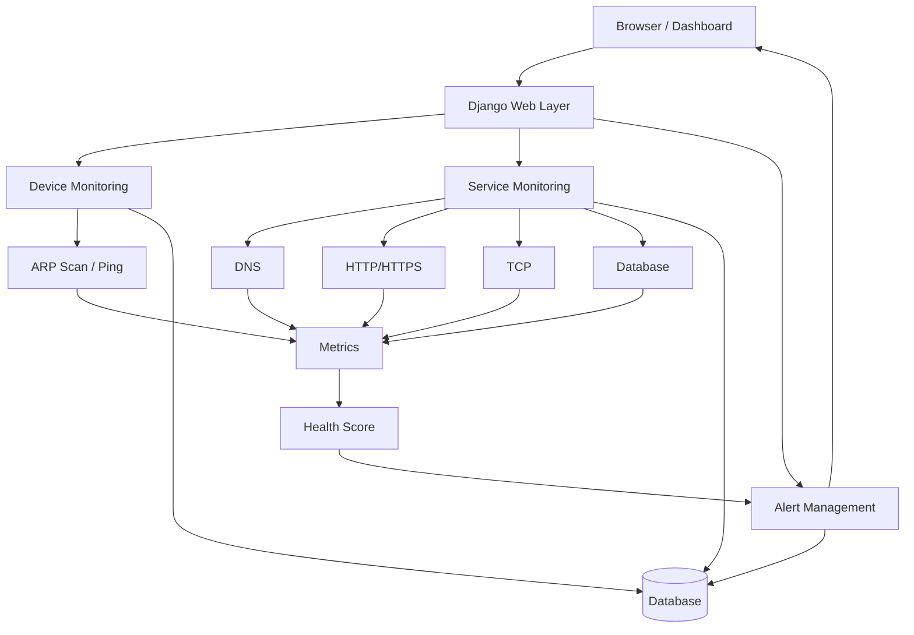
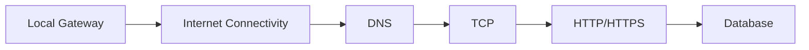
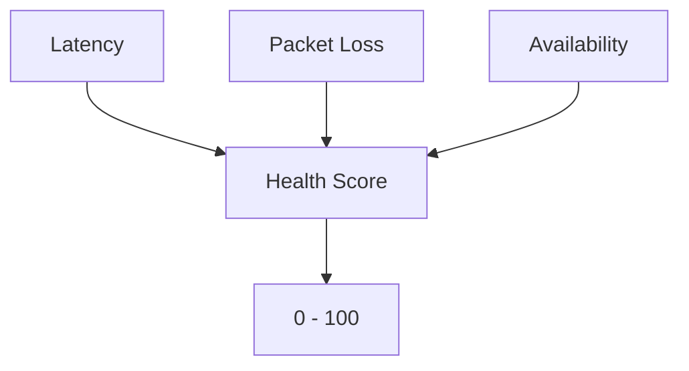
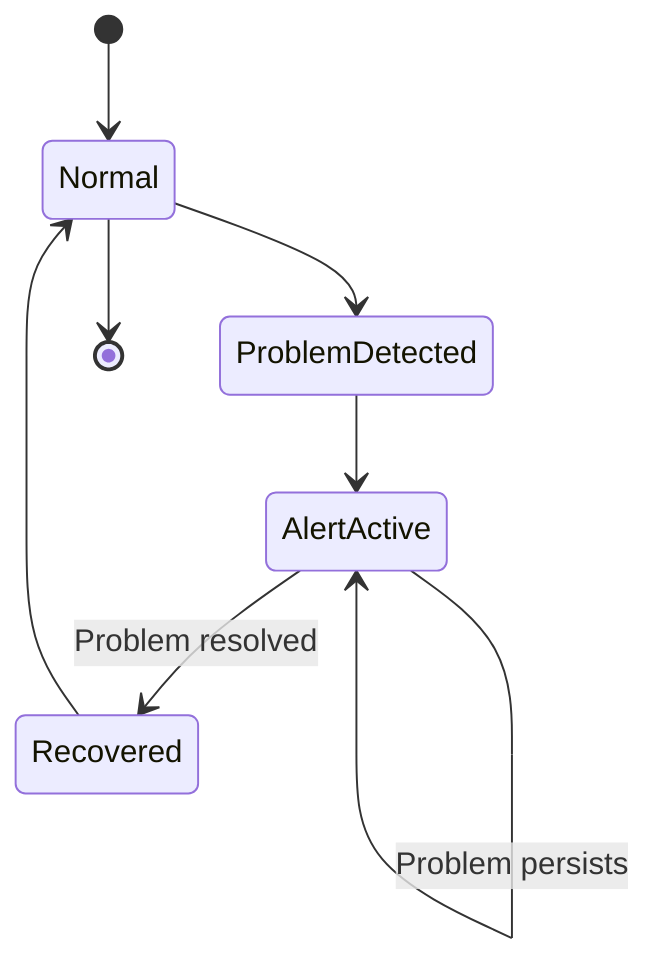
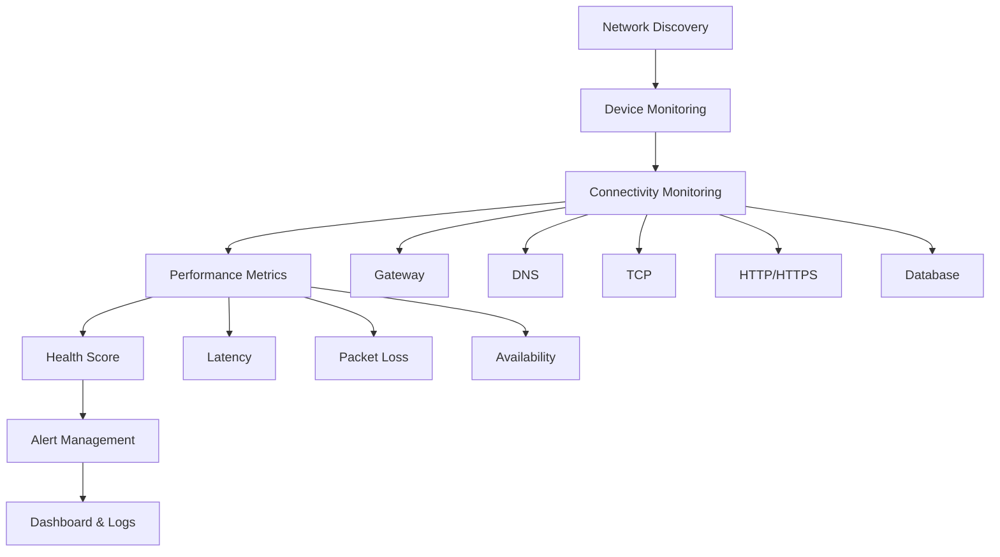

# 🌐 سامانه مانیتورینگ شبکه (Network Monitoring System)
# این متن توسط هوش مصنوعی نوشته شده است برای اطلاعات دقیق تر نسخه انگلیسی فایل README خوانده شود.
> یک سامانه تحت وب مبتنی بر Django برای پایش شبکه، سرویس‌های زیرساختی، وضعیت دستگاه‌ها، شاخص‌های عملکرد و مدیریت هشدارها.

<p align="center">
  
  
  
</p>

<p align="center">
  <strong>Network Discovery • Device Monitoring • Service Health • Metrics • Health Score • Alert Management</strong>
</p>

---

## 📌 فهرست مطالب

- [معرفی پروژه](#-معرفی-پروژه)
- [هدف پروژه](#-هدف-پروژه)
- [معماری سیستم](#-معماری-سیستم)
- [Network Discovery](#-network-discovery)
- [مانیتورینگ اتصال شبکه](#-مانیتورینگ-اتصال-شبکه)
- [Latency و Packet Loss](#-latency-و-packet-loss)
- [سیستم Alerting](#-سیستم-alerting)
- [مدیریت وضعیت Alert](#-مدیریت-وضعیت-alert)
- [Logging](#-logging)
- [Dashboard](#-dashboard)
- [احراز هویت](#-احراز-هویت)
- [ساختار پروژه](#-ساختار-پروژه)
- [Technology Stack](#-technology-stack)
- [Database](#-database)
- [Docker](#-docker)
- [امنیت](#-امنیت)
- [تست](#-تست)
- [بهبودهای آینده](#-بهبودهای-آینده)
- [هدف دانشگاهی](#-هدف-دانشگاهی)
- [وضعیت پروژه](#-وضعیت-پروژه)
- [مشارکت](#-مشارکت)
- [License](#-license)

---

# 🎯 معرفی پروژه

**Network Monitoring System** یک سامانه تحت وب برای مشاهده و تحلیل وضعیت شبکه است که با استفاده از **Python** و **Django** توسعه داده شده است.

این سیستم اطلاعات مختلف شبکه را جمع‌آوری و در یک Dashboard متمرکز نمایش می‌دهد و علاوه بر وضعیت دستگاه‌ها، سلامت سرویس‌های زیرساختی و شاخص‌های عملکرد شبکه را نیز بررسی می‌کند.

موارد اصلی قابل پایش عبارت‌اند از:

- وضعیت اتصال اینترنت
- Gateway شبکه
- دستگاه‌های موجود در LAN
- وضعیت Online / Offline دستگاه‌ها
- Latency
- Packet Loss
- DNS Resolution
- HTTP/HTTPS Connectivity
- TCP Connectivity
- Database Connectivity
- Availability
- Health Score
- رخدادها و Logs
- هشدارها و Recovery Events

هدف سیستم این است که کاربر به جای بررسی دستی و پراکنده وضعیت شبکه، یک نمای متمرکز، قابل فهم و قابل تحلیل از زیرساخت شبکه در اختیار داشته باشد.

---

# 🎯 هدف پروژه

این پروژه با چند هدف اصلی طراحی شده است:

### 1. Network Discovery

شناسایی دستگاه‌های موجود در شبکه محلی و ثبت اطلاعات مربوط به آن‌ها.

### 2. Continuous Monitoring

پایش مستمر وضعیت شبکه، دستگاه‌ها و سرویس‌ها.

### 3. Fault Detection

شناسایی سریع اختلال، قطعی، کاهش کیفیت و تغییر وضعیت سرویس‌ها.

### 4. Performance Monitoring

اندازه‌گیری شاخص‌هایی مانند:

- Latency
- Packet Loss
- Availability
- Response Time

### 5. Alert Management

ایجاد و مدیریت هشدارها، تعیین Severity مناسب، جلوگیری از Alert Spam و تشخیص Recovery.

### 6. Centralized Dashboard

نمایش اطلاعات مهم سیستم در یک محیط یکپارچه و قابل استفاده.

---

# 🚀 قابلیت‌های اصلی

| قابلیت | وضعیت |
|---|---:|
| Network Discovery | ✅ |
| ARP Scanning | ✅ |
| Device Management | ✅ |
| Online / Offline Detection | ✅ |
| Ping Monitoring | ✅ |
| Latency Measurement | ✅ |
| Packet Loss Monitoring | ✅ |
| Gateway Monitoring | ✅ |
| DNS Monitoring | ✅ |
| Web Monitoring | ✅ |
| TCP Port Monitoring | ✅ |
| Database Health Check | ✅ |
| Availability Monitoring | ✅ |
| Health Score | ✅ |
| Alerting System | ✅ |
| Alert Severity | ✅ |
| Alert State Management | ✅ |
| Recovery Detection | ✅ |
| Event Logging | ✅ |
| Dashboard | ✅ |
| Authentication | ✅ |
| Configurable Monitoring Targets | ✅ |
| Docker Support | ✅ |

---

# 🏗 معماری سیستم

نمای کلی معماری:



---

# 🔎 Network Discovery

برای شناسایی دستگاه‌های موجود در شبکه محلی از **ARP Scanning** استفاده می‌شود.

فرآیند کلی:

```text
Network
   ↓
ARP Scan
   ↓
Detected Devices
   ↓
IP + MAC
   ↓
Device Reconciliation
   ↓
Database
```

هنگام مشاهده دستگاه جدید:

```text
New Device
    ↓
Create / Update Device
    ↓
first_seen
    ↓
is_online = True
```

و هنگام عدم مشاهده یک دستگاه شناخته‌شده:

```text
Missing Device
      ↓
Offline Detection
      ↓
Update Device State
      ↓
Create / Update Alert
```

---

# 💻 مانیتورینگ دستگاه‌ها

برای هر Device می‌توان اطلاعاتی مانند موارد زیر را نگهداری کرد:

- IP Address
- MAC Address
- Name
- Device Type
- Online Status
- First Seen
- Last Seen
- Latest Ping
- Latency
- Packet Loss

ساختار منطقی:

```text
Device
├── IP Address
├── MAC Address
├── Name
├── Device Type
├── Is Online
├── First Seen
├── Last Seen
├── Latest Ping
├── Latency
└── Packet Loss
```

---

# 📡 مانیتورینگ اتصال شبکه

سیستم برای تعیین وضعیت شبکه فقط به یک Ping وابسته نیست، بلکه چند لایه مختلف را بررسی می‌کند.



برای نمونه ممکن است وضعیت زیر مشاهده شود:

```text
Gateway      → UP
DNS          → UP
TCP 443      → UP
HTTP         → DOWN
```

در چنین شرایطی سیستم می‌تواند تفاوت میان «قطع کامل شبکه» و «اختلال یک سرویس خاص» را بهتر مشخص کند.

---

# 🌍 مانیتورینگ سرویس‌ها

یکی از بخش‌های مهم پروژه، بررسی سلامت سرویس‌های زیرساختی است.

## DNS

بررسی Resolution شدن یک Hostname مشخص:

```text
DNS_HOSTNAME
```

## Web

بررسی دسترسی به یک URL مشخص از طریق HTTP یا HTTPS:

```text
WEB_URL
```

## TCP

بررسی امکان برقراری اتصال به Host و Port مشخص:

```text
TCP_HOST
TCP_PORT
```

## Database

بررسی وضعیت اتصال Django به Database.

## Gateway

بررسی دسترسی به Gateway شبکه محلی.

---

# ⚙️ Monitoring Targets قابل تنظیم

یکی از ویژگی‌های مهم سیستم این است که Targetهای Monitoring می‌توانند قابل تنظیم باشند و به مقادیر ثابت وابسته نباشند.

نمونه تنظیمات:

```text
DNS Hostname:
google.com

Web URL:
https://www.google.com

TCP Host:
www.google.com

TCP Port:
443
```

این قابلیت امکان استفاده از سیستم برای سرویس‌ها و شبکه‌های مختلف را فراهم می‌کند.

---

# 📊 Latency و Packet Loss

## Latency

سیستم زمان پاسخ Network Requestها را اندازه‌گیری می‌کند.

نمونه:

```text
Target:
8.8.8.8

Result:
92.1 ms
```

Latency می‌تواند در موارد زیر استفاده شود:

- نمایش مقدار فعلی
- محاسبه Health Score
- نمایش Trend
- تشخیص High Latency
- تولید Alert

## Packet Loss

Packet Loss نیز یکی از شاخص‌های کلیدی سلامت شبکه است.

نمونه:

```text
Packets Sent:      100
Packets Received:   97

Packet Loss:       3%
```

Packet Loss زیاد می‌تواند نشانه‌ای از مشکلاتی مانند Congestion، Wi-Fi ضعیف، Routing Problem یا ناپایداری اتصال باشد.

---

# ❤️ Health Score

برای ارائه یک نمای ساده از سلامت شبکه، سیستم یک **Health Score** در بازه 0 تا 100 محاسبه می‌کند.



## امتیاز Latency

به صورت کلی، هرچه Latency کمتر باشد امتیاز بهتر است:

| Latency | وضعیت کلی |
|---:|---|
| ≤ 50 ms | عالی |
| ≤ 100 ms | خوب |
| ≤ 200 ms | متوسط |
| ≤ 500 ms | ضعیف |
| > 500 ms | بحرانی |

## Availability Score

Availability در محدوده مشخص نرمال‌سازی می‌شود و در Health Score مورد استفاده قرار می‌گیرد.

## Packet Loss Score

هرچه Packet Loss کمتر باشد، امتیاز سلامت شبکه بیشتر خواهد بود.

در نتیجه Health Score دیدی ترکیبی از وضعیت عملکرد شبکه ارائه می‌دهد.

---

# 🚨 سیستم Alerting

سیستم Alerting یکی از اجزای اصلی پروژه است و برای تشخیص، ثبت و مدیریت رخدادهای غیرعادی طراحی شده است.

اهداف اصلی این بخش:

- تشخیص Event
- تعیین Severity
- مدیریت State
- جلوگیری از Alert Spam
- تشخیص Recovery
- به‌روزرسانی وضعیت Incident

---

# 🔔 Severity

سطوح اصلی هشدار:

```text
INFO
WARNING
CRITICAL
```

اولویت‌ها:

```text
INFO      → 1
WARNING   → 2
CRITICAL  → 3
```

این ساختار امکان دسته‌بندی و اولویت‌بندی Alertها را فراهم می‌کند.

---

# 🔄 مدیریت وضعیت Alert

برای اینکه یک مشکل مداوم باعث تولید Alertهای بی‌شمار نشود، وضعیت Alert به شکل State مدیریت می‌شود.



روند ساده:

```text
Normal
  ↓
Problem Detected
  ↓
Alert Created
  ↓
Problem Persists
  ↓
Existing Alert Updated
  ↓
Problem Resolved
  ↓
Recovery
```

---

# 🛑 جلوگیری از Alert Spam

یکی از مشکلات رایج سامانه‌های Monitoring، تولید تعداد بسیار زیادی Alert مشابه است.

مثلاً:

```text
Internet Down
Internet Down
Internet Down
Internet Down
...
```

در طراحی Alerting تلاش شده است یک Incident پایدار به یک مجموعه بزرگ از Alertهای تکراری تبدیل نشود و وضعیت موجود مدیریت شود.

---

# 🟢 Recovery Detection

سیستم علاوه بر تشخیص Failure، بازگشت سرویس را نیز تشخیص می‌دهد.

مثال:

```text
Internet
   ↓
DOWN
   ↓
CRITICAL ALERT
   ↓
Connectivity Restored
   ↓
RECOVERY EVENT
   ↓
INFO
```

این قابلیت باعث می‌شود کاربر هم از شروع مشکل و هم از رفع آن مطلع شود.

---

# 📝 Logging

رخدادهای مهم سیستم در قالب Log ثبت می‌شوند.

نمونه‌ها:

```text
INFO
Ping successful
```

```text
WARNING
High latency detected
```

```text
CRITICAL
Internet connectivity lost
```

```text
INFO
Internet connectivity restored
```

Logging برای Debug، تحلیل رخدادها و بررسی تاریخچه وضعیت سیستم اهمیت زیادی دارد.

---

# 📈 Dashboard

Dashboard نقطه مرکزی مشاهده اطلاعات سیستم است.

بخش‌های اصلی Dashboard می‌توانند شامل موارد زیر باشند:

### ❤️ Network Health

```text
Health Score: 85%
```

### 📡 Service Status

- Internet
- Gateway
- DNS
- TCP
- Web
- Database

### 💻 Devices

- IP
- MAC
- Name
- Type
- Status
- Latency

### 🚨 Alerts

نمایش Alertهای اخیر بر اساس Severity.

### 📝 Logs

نمایش رخدادهای اخیر سیستم.

### 📊 Latency Trend

نمایش روند Latency در نمونه‌های اخیر.

---

# 🔐 احراز هویت

دسترسی به بخش‌های حساس سیستم از طریق Authentication کنترل می‌شود.

هدف این بخش جلوگیری از دسترسی افراد غیرمجاز به اطلاعات Monitoring و Dashboard است.

---

# 📁 ساختار پروژه

ساختار کلی پروژه می‌تواند مشابه ساختار زیر باشد:

```text
Network_Monitoring/
│
├── manage.py
├── requirements.txt
├── Dockerfile
├── docker-compose.yml
├── .env
├── .gitignore
│
├── project/
│   ├── settings.py
│   ├── urls.py
│   ├── asgi.py
│   └── wsgi.py
│
├── monitor/
│   ├── models.py
│   ├── views.py
│   ├── urls.py
│   ├── forms.py
│   ├── admin.py
│   ├── services.py
│   ├── alerts.py
│   ├── monitoring.py
│   ├── scanner.py
│   └── ...
│
├── templates/
│   ├── dashboard.html
│   ├── login.html
│   └── ...
│
├── static/
│   ├── css/
│   ├── js/
│   └── ...
│
└── media/
```

> ساختار واقعی ممکن است با نسخه نهایی Repository کمی متفاوت باشد.

---

# 🧰 Technology Stack

## Backend

- Python
- Django
- Django ORM

## Network

- Scapy
- ping3
- ARP
- ICMP
- TCP
- DNS
- HTTP/HTTPS

## Database

- MySQL
- Django Database Backend

## Frontend

- HTML5
- CSS3
- JavaScript
- Django Templates
- AJAX / Fetch API

## Infrastructure

- Docker
- Docker Compose
- Environment Variables

## Development

- Git
- GitHub
- Linux / Windows

---

# 📦 نصب و راه‌اندازی

## 1. دریافت پروژه

```bash
git clone <repository-url>
cd Network_Monitoring
```

## 2. ساخت Virtual Environment

### Windows

```bash
python -m venv venv
venv\Scripts\activate
```

### Linux / macOS

```bash
python3 -m venv venv
source venv/bin/activate
```

## 3. نصب وابستگی‌ها

```bash
pip install -r requirements.txt
```

---

# ⚙️ Configuration

تنظیمات حساس بهتر است از Environment Variables دریافت شوند.

نمونه:

```env
DJANGO_SECRET_KEY=your-secret-key
DJANGO_DEBUG=False

DB_NAME=network_monitor
DB_USER=your-user
DB_PASSWORD=your-password
DB_HOST=localhost
DB_PORT=3306
```

تنظیمات Monitoring نیز می‌توانند شامل موارد زیر باشند:

```env
DNS_HOSTNAME=google.com
WEB_URL=https://www.google.com
TCP_HOST=www.google.com
TCP_PORT=443
```

> اطلاعات حساس مانند Password و Secret Key نباید داخل Repository عمومی قرار گیرند.

---

# 🗄 Database

پس از تنظیم Database، Migrationها را اجرا کنید:

```bash
python manage.py makemigrations
python manage.py migrate
```

برای ساخت Superuser:

```bash
python manage.py createsuperuser
```

---

# ▶️ اجرای پروژه

برای اجرای Development Server:

```bash
python manage.py runserver
```

سپس به آدرس زیر مراجعه کنید:

```text
http://127.0.0.1:8000/
```

---

# 🐳 Docker

پروژه برای اجرای Containerized نیز قابل استفاده است.

ساخت Image:

```bash
docker build -t network-monitoring .
```

اجرای Container:

```bash
docker run -p 8000:8000 network-monitoring
```

در صورت استفاده از Docker Compose:

```bash
docker compose up --build
```

---

# 🔒 امنیت

نکات مهم امنیتی:

### Secret Key

Secret Key نباید در Source Code به صورت ثابت قرار گیرد.

```python
SECRET_KEY = os.environ.get("DJANGO_SECRET_KEY")
```

### Debug

در Production:

```text
DEBUG=False
```

### Allowed Hosts

تنها Hostهای موردنیاز باید در `ALLOWED_HOSTS` تعریف شوند.

### Secrets

اطلاعات حساس شامل موارد زیر نباید Commit شوند:

- Database Password
- Secret Key
- API Keys
- Credentials

### Authentication

بخش‌های مدیریتی و Dashboard باید تحت کنترل Authentication باشند.

---

# ⚡ عملکرد و بهینه‌سازی

در طراحی سیستم موارد زیر مورد توجه قرار گرفته‌اند:

- جلوگیری از درخواست‌های غیرضروری
- جداسازی Monitoring Logic از Viewها
- نگهداری State در Database
- جلوگیری از Alertهای تکراری
- محدود کردن داده‌های Trend
- استفاده از Polling / Fetch برای به‌روزرسانی بخش‌های Dashboard
- کاهش وابستگی مستقیم UI به عملیات سنگین Network
- استفاده از Transaction در بخش‌های حساس State Management

---

# 🔄 به‌روزرسانی Dashboard

برای بعضی از بخش‌ها می‌توان بدون Reload کامل صفحه اطلاعات را به‌روز کرد.

```text
Dashboard
    ↓
JavaScript fetch()
    ↓
Django API
    ↓
Monitoring / Service Check
    ↓
JSON Response
    ↓
Update UI
```

این مدل باعث تجربه کاربری روان‌تر و کاهش Reloadهای غیرضروری می‌شود.

---

# 🧪 تست

سناریوهای پیشنهادی برای تست سیستم:

## قطع اینترنت

بررسی:

```text
Connectivity
Alert
Log
Health Score
```

## بازگشت اینترنت

بررسی ایجاد Recovery Event.

## Latency بالا

بررسی تغییر Health Score و Severity هشدار.

## Packet Loss

بررسی تغییر وضعیت شبکه و Alert.

## Offline شدن Device

بررسی:

```text
Device Status
Alert
Log
```

## خرابی یک سرویس

مثلاً غیرفعال کردن Web یا TCP Target و بررسی Service Monitoring.

---

# 🧩 جریان کلی سیستم



---

# 🔮 بهبودهای آینده

قابلیت‌های زیر می‌توانند در نسخه‌های بعدی اضافه شوند:

## Notification System

ارسال هشدار از طریق:

- Email
- Telegram
- Discord
- Web Push

## Historical Analytics

ذخیره و تحلیل بلندمدت:

- Latency
- Packet Loss
- Availability
- Downtime

## Advanced Charts

افزودن نمودارهای:

- Latency History
- Packet Loss History
- Availability
- Device Uptime
- Network Traffic

## User Roles

ایجاد Roleهای مختلف مانند:

```text
Admin
Operator
Viewer
```

## Alert Rules

امکان تعریف Rule توسط کاربر:

```text
IF latency > 200ms
THEN WARNING
```

یا:

```text
IF packet_loss > 20%
THEN CRITICAL
```

## Maintenance Mode

جلوگیری از تولید Alert هنگام تعمیرات برنامه‌ریزی‌شده.

## Alert Escalation

افزایش Severity در صورت ادامه‌دار بودن مشکل:

```text
WARNING
   ↓
5 minutes
   ↓
CRITICAL
```

## Multi-Network Monitoring

پشتیبانی از چند Subnet و چند Network Segment.

## Distributed Monitoring

استفاده از Monitoring Agentهای متعدد برای شبکه‌های مختلف.

---

# 🎓 هدف دانشگاهی

این پروژه با هدف پیاده‌سازی و ترکیب مفاهیم **مهندسی شبکه** و **توسعه نرم‌افزار** طراحی شده است.

مفاهیم کلیدی مورد استفاده:

- Network Monitoring
- Network Discovery
- ARP
- ICMP
- TCP/IP
- DNS
- HTTP/HTTPS
- Network Availability
- Fault Detection
- Performance Monitoring
- Alert Management
- Web Application Development
- Database Design
- Software Architecture
- Containerization

این پروژه نمونه‌ای از ترکیب یک سامانه مانیتورینگ شبکه با یک Web Application متمرکز است.

---

# 📌 وضعیت پروژه

```text
Project:          Network Monitoring System
Backend:          Django
Language:         Python
Database:         MySQL
Network:          Scapy / ping3
Frontend:         HTML / CSS / JavaScript
Deployment:       Docker
Monitoring:       Network + Services
Alerting:         Enabled
Authentication:   Enabled
```

---

# 🤝 مشارکت

برای مشارکت در توسعه پروژه:

1. Repository را Fork کنید.
2. یک Branch جدید ایجاد کنید.
3. تغییرات را اعمال کنید.
4. تست‌های لازم را اجرا کنید.
5. Pull Request ارسال کنید.

نمونه:

```bash
git checkout -b feature/new-monitoring-feature

git add .

git commit -m "Add new monitoring feature"

git push origin feature/new-monitoring-feature
```

---

# 📄 License

این پروژه با هدف آموزشی و دانشگاهی توسعه داده شده است.

در صورت تعیین License رسمی، این بخش را می‌توان با License موردنظر جایگزین کرد.

---

# ⭐ جمع‌بندی

**Network Monitoring System** یک سامانه متمرکز برای مشاهده، تحلیل و مدیریت سلامت شبکه است.

سیستم از **Network Discovery** شروع می‌کند، دستگاه‌های موجود را شناسایی می‌کند، وضعیت اتصال و سرویس‌های مختلف را بررسی می‌کند، شاخص‌هایی مانند **Latency، Packet Loss و Availability** را تحلیل می‌کند و در نهایت با استفاده از **Health Score** و **Alerting System** وضعیت شبکه را به شکل قابل فهم در اختیار کاربر قرار می‌دهد.

```text
             🌐 NETWORK
                  │
                  ▼
          🔍 NETWORK DISCOVERY
                  │
                  ▼
            💻 DEVICES
                  │
                  ▼
        📡 CONNECTIVITY CHECKS
                  │
                  ▼
            📊 METRICS
                  │
                  ▼
          ❤️ HEALTH SCORE
                  │
                  ▼
          🚨 ALERT MANAGEMENT
                  │
                  ▼
          📈 DASHBOARD & LOGS
```

> **یک پلتفرم تحت وب برای شناسایی، پایش، تحلیل و مدیریت سلامت شبکه و رخدادهای زیرساختی.**

---

<p align="center">
  ساخته‌شده با ❤️ برای مانیتورینگ بهتر شبکه
</p>
