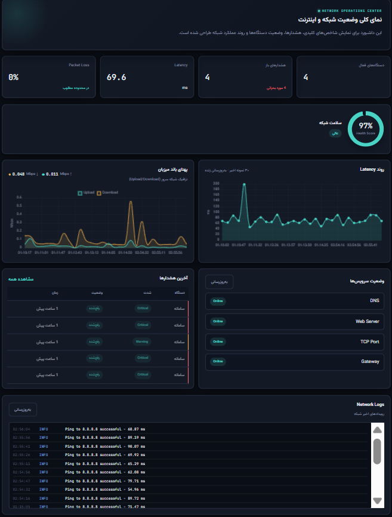
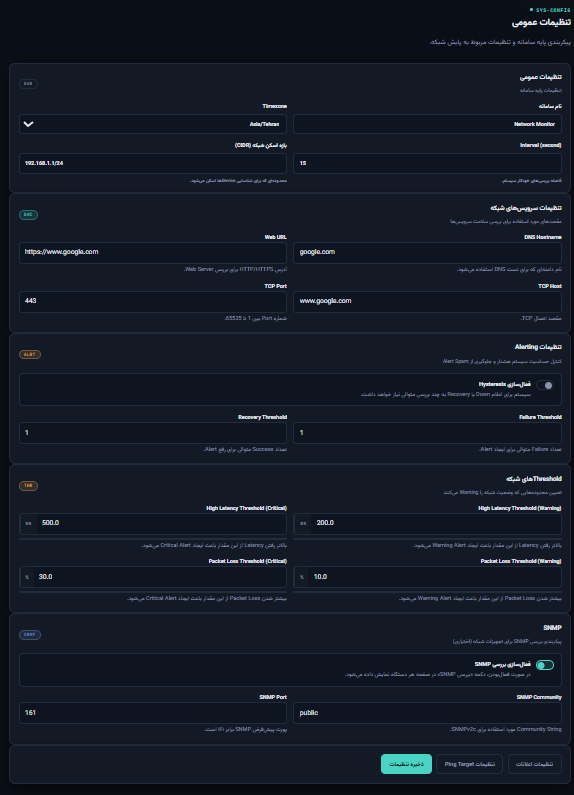
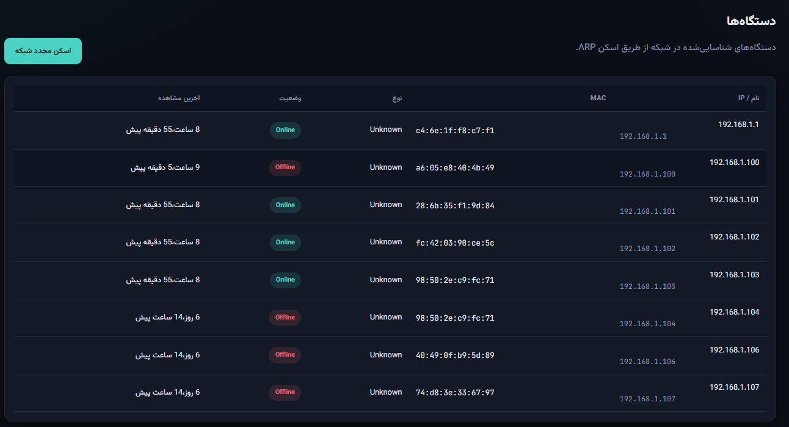
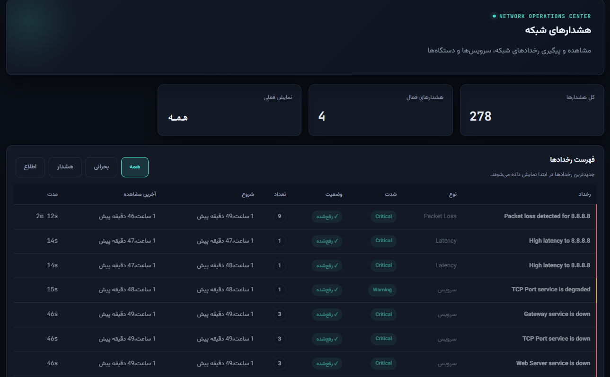
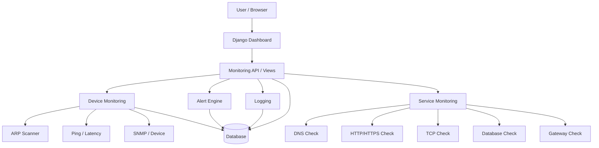
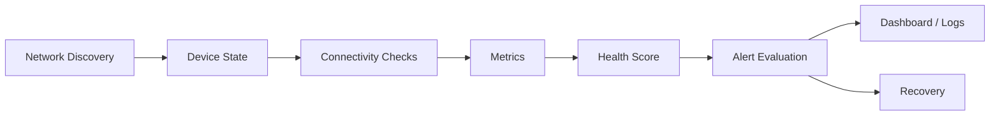
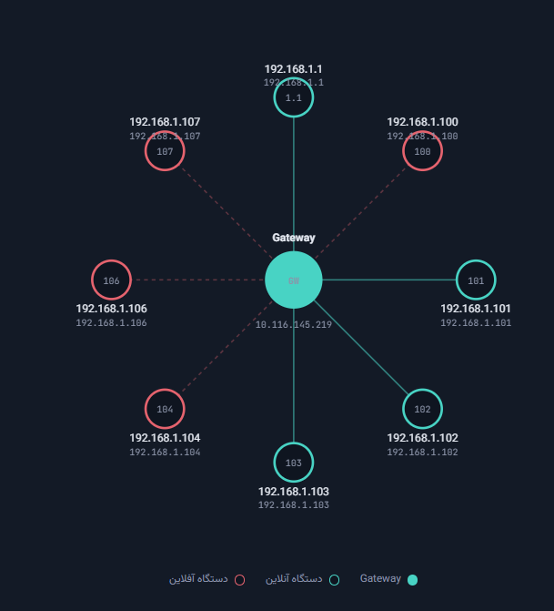
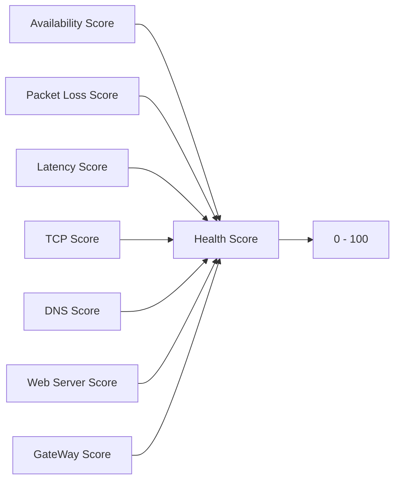
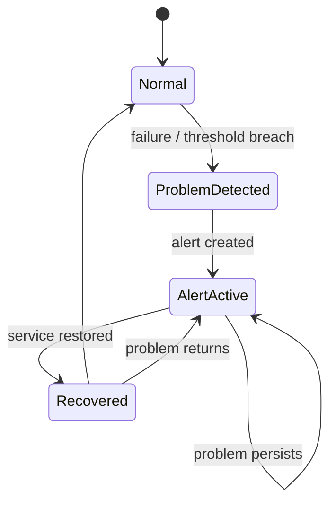

# 🌐 Network Monitoring System

 


<p align="center">
  <strong>A web-based network monitoring and infrastructure health platform built with Django</strong>
</p>

<p align="center">
  <a href="#-features"></a>
  <a href="#-technology-stack"></a>
  <a href="#-technology-stack"></a>
</p>

<p align="center">
  <a href="#-installation">Installation</a> •
  <a href="#-architecture">Architecture</a> •
  <a href="#-alerting-system">Alerting</a> •
</p>

---

## 📖 Overview

**Network Monitoring System** is a Django-based monitoring platform designed to provide a centralized view of network health, device availability, connectivity, service status, performance metrics, logs, and alerts.

The system combines **LAN discovery**, **device monitoring**, **connectivity checks**, **service health checks**, **latency and packet-loss analysis**, **health scoring**, and **state-aware alerting** into a single web dashboard.

The project is designed with a practical monitoring workflow in mind:

```text
Discover → Monitor → Measure → Classify → Alert → Recover → Analyze
```

It can be used as a foundation for monitoring a local network, internet connectivity, infrastructure services, or as an academic project demonstrating the integration of **computer networks, backend development, databases, and web interfaces**.

---

## ✨ Features

### 🔎 Network Discovery

- LAN device discovery using ARP scanning
- Detection of IP and MAC addresses
- Synchronization of discovered devices with the database
- Detection of newly discovered devices
- Detection of devices that become unavailable
- Tracking of first-seen and last-seen timestamps

### 💻 Device Monitoring

- Device online/offline state
- IP address and MAC address tracking
- Device name and device type
- Latest ping result
- Latency monitoring
- Packet-loss statistics
- Last-seen information

### 🌐 Connectivity Monitoring

The system does not rely on a single check to determine whether the network is healthy. Multiple layers can be evaluated independently:

- Local gateway reachability
- Internet connectivity
- DNS resolution
- HTTP/HTTPS availability
- TCP host/port reachability
- Database connectivity

This allows the application to distinguish between different failure modes instead of reporting every problem as a generic "Internet Down" event.

### 🧪 Service Health Checks

The service monitoring layer supports checks for:

| Service | Purpose |
|---|---|
| **DNS** | Resolves a configurable hostname |
| **Web** | Verifies HTTP/HTTPS reachability of a configurable URL |
| **TCP** | Checks connectivity to a configurable host and port |
| **Database** | Verifies Django database connectivity |
| **Gateway** | Checks reachability of the local network gateway |

Each check can be classified based on both **success/failure** and **response latency**.

### 📊 Performance Monitoring

- Ping latency measurement
- Packet-loss calculation
- Response-time tracking
- Recent latency trend visualization
- Availability tracking
- Degraded-service detection based on latency thresholds

### ❤️ Network Health Score

The dashboard can combine multiple indicators into a single health score to make the current network condition easier to understand.

The scoring model considers factors such as:

- Availability
- Packet loss
- Latency
- Services

A normalized score in the **0–100** range is used for presentation.

Example latency classification used by the monitoring logic:

| Latency | Interpretation |
|---:|---|
| `≤ 50 ms` | Excellent |
| `≤ 100 ms` | Good |
| `≤ 200 ms` | Moderate |
| `≤ 500 ms` | Poor |
| `> 500 ms` | Critical |

### 🚨 Alerting System

The alerting layer is designed around **state management**, rather than creating an independent alert for every repeated observation.

Supported severity levels:

```text
INFO
WARNING
CRITICAL
```

Severity priority:

```text
INFO      → 1
WARNING   → 2
CRITICAL  → 3
```

The alert workflow supports concepts such as:

- Problem detection
- Alert creation
- Severity classification
- Alert-state tracking
- Repeated-event suppression
- Persistent problem tracking
- Recovery detection
- Recovery logging

This helps prevent alert spam when the same problem persists across multiple monitoring cycles.

### 📝 Logging

The system records important monitoring events such as:

- Successful ping operations
- High latency conditions
- Connectivity failures
- Connectivity recovery
- Device availability changes
- Service-check results
- Alert-related events

Example event flow:

```text
INFO     → Ping successful
WARNING  → High latency detected
CRITICAL → Connectivity lost
INFO     → Connectivity restored
```

### 📈 Dashboard

The dashboard provides a centralized operational view of the network, including areas such as:

- Overall health score
- Connectivity status
- Service status
- Device table
- Recent alerts
- Event logs
- Latency trend
- Bandwidth trend
- Monitoring metrics

Where appropriate, dashboard data can be refreshed asynchronously using JavaScript/AJAX without requiring a full page reload.

### 🔐 Authentication

Protected monitoring pages can be accessed through Django authentication, helping prevent unauthenticated access to operational information.

---

## 🧭 Project Goals

The main goals of the project are:

1. **Network Discovery** — identify devices available on the local network.
2. **Continuous Monitoring** — continuously evaluate connectivity and infrastructure health.
3. **Fault Detection** — detect failures, degraded services, and availability changes.
4. **Performance Analysis** — measure latency, packet loss, response time, and availability.
5. **Alert Management** — create meaningful alerts while avoiding unnecessary duplication.
6. **Centralized Visualization** — present network status through a single web dashboard.
7. **Operational Insight** — provide enough information to understand not only that a service failed, but also where the failure appears to be occurring.

---

## 🏗 Architecture

### High-Level Architecture



### Monitoring Pipeline



### Connectivity Model

```text
                    ┌────────────────────┐
                    │   Network Status   │
                    └─────────┬──────────┘
                              │
          ┌───────────────────┼───────────────────┐
          │                   │                   │
          ▼                   ▼                   ▼
      Gateway              Internet          Infrastructure
          │                   │                   │
          │          ┌────────┼────────┐      ┌────┼────┐
          │          ▼        ▼        ▼      ▼    ▼    ▼
          │         DNS      TCP      Web     DB  Logs Alerts
          │
          └──────────────────────────────────────────────
```

---

## 🔎 Network Discovery

The discovery subsystem uses **ARP-based scanning** to identify hosts on the local network.



Typical workflow:

```text
Network / Subnet
       ↓
    ARP Scan
       ↓
Detected Hosts
       ↓
 IP + MAC data
       ↓
Device Reconciliation
       ↓
   Database
```

When a new host is detected, the system can create a corresponding device record. When an existing host is no longer detected, its state can be updated and the alerting layer can evaluate the resulting change.

---

## 💻 Device Model

A monitored device can contain information such as:

```text
Device
├── IP Address
├── MAC Address
├── Name
├── Device Type
├── Online Status
├── First Seen
├── Last Seen
├── Latest Ping
├── Latency
└── Packet Loss
```

This model enables both current-state monitoring and basic historical context.

---

## 📡 Connectivity Monitoring

A key design principle is to treat connectivity as a **multi-layer problem**.

For example, the following state is possible:

```text
Gateway      → UP
DNS          → UP
TCP 443      → UP
HTTP         → DOWN
```

This does not necessarily mean that the entire network is offline. Instead, it indicates that the failure may be isolated to a specific application/service layer.

This layered approach makes diagnosis more useful than relying on a single ping result.

---

## 🌍 Service Monitoring

### DNS Check

Resolves a configurable hostname and measures the result and response time.

### Web Check

Verifies that a configurable HTTP/HTTPS URL can be reached.

### TCP Check

Attempts to establish a TCP connection to a configurable host and port.

### Database Check

Verifies that the Django application can communicate with its database backend.

### Gateway Check

Tests reachability of the local network gateway.

### Service Classification

A service result can be classified into states such as:

```text
SUCCESS
WARNING / DEGRADED
DANGER / FAILED
```

The exact classification can take both **availability** and **latency threshold** into account.

Example threshold configuration:

| Check | Example Degraded Threshold |
|---|---:|
| DNS | `200 ms` |
| Web | `1000 ms` |
| TCP | `300 ms` |
| Database | `100 ms` |
| Gateway | `50 ms` |

These values are examples of the project's monitoring logic and can be adjusted according to the target environment.

---

## 📊 Latency & Packet Loss

### Latency

Latency is measured from monitoring requests such as ICMP/ping operations and service checks.

Example:

```text
Ping Target : 8.8.8.8
Latency     : 92.1 ms
```

Latency values can be used for:

- Real-time status
- Trend visualization
- Degraded-service classification
- Health scoring
- Alert evaluation

### Packet Loss

Packet loss is calculated from sent and successfully received packets.

Example:

```text
Packets Sent     : 100
Packets Received : 97
Packet Loss      : 3%
```

High packet loss can indicate congestion, poor wireless conditions, routing issues, unstable links, or hardware/network problems.

---

## ❤️ Health Score

The health score provides a single, human-readable indicator of the current monitoring state.

Conceptually:




The final value is bounded to the `0–100` range.

A simplified interpretation is:

```text
90 - 100   Excellent
75 - 89    Good
50 - 74    Moderate
25 - 49    Poor
0  - 24    Critical
```

These ranges are intended as a UI interpretation layer and can be changed independently of the underlying scoring functions.

---

## 🚨 Alerting System

Alerting is designed around **events + state**, rather than treating every polling result as an entirely new incident.

### Alert Lifecycle



### Severity

```text
INFO      → Priority 1
WARNING   → Priority 2
CRITICAL  → Priority 3
```

### Why State Matters

Without state management, a persistent failure could create a new alert every few seconds:

```text
Internet Down
Internet Down
Internet Down
Internet Down
Internet Down
...
```

A state-aware system can instead maintain one active incident and update its state until recovery occurs.

### Recovery

Recovery is treated as a meaningful event rather than silently returning to normal.

Example:

```text
Internet
   ↓
DOWN
   ↓
CRITICAL ALERT
   ↓
Connectivity Restored
   ↓
RECOVERY EVENT
   ↓
INFO
```

---

## 📝 Logging

Monitoring logs provide an operational history of important system events.

Typical examples:

```text
INFO     Ping successful - 70.53 ms
WARNING  High latency detected
CRITICAL Internet connectivity lost
INFO     Internet connectivity restored
```

Logs are useful for:

- Troubleshooting
- Incident analysis
- Debugging
- Understanding recovery behavior
- Correlating alerts with monitoring events

---

## 📈 Dashboard

The web dashboard is the main operational interface.

Typical sections include:

### Network Health

Displays an overall health score and major health indicators.

### Service Status

Shows the state of gateway, DNS, web, TCP, database, and other checks.

### Device Table

Displays monitored devices and their latest known state.

### Alerts

Shows recent alert events and severity levels.

### Live Logs

Presents monitoring events in a readable format.

### Latency Trend

Visualizes recent latency values and helps identify degradation or instability.

### Asynchronous Updates

Selected dashboard components can be refreshed using JavaScript `fetch()` / AJAX without a complete page reload.

Example flow:

```text
Dashboard
    ↓
fetch()
    ↓
Django API
    ↓
Run Service Checks
    ↓
JSON Response
    ↓
Update UI
```

---

## 🧰 Technology Stack

| Layer | Technology |
|---|---|
| Backend | **Python + Django** |
| ORM | **Django ORM** |
| Network Discovery | **Scapy / ARP** |
| Connectivity | **ICMP / TCP / DNS / HTTP(S)** |
| Ping | **ping3** |
| Frontend | **HTML5 / CSS3 / JavaScript** |
| Templates | **Django Templates** |
| Database | **MySQL** |
| Containerization | **Docker / Docker Compose** |
| Version Control | **Git / GitHub** |

---

## 📁 Project Structure

A representative structure is:

```text
Network_Monitoring/
│
├── manage.py
├── requirements.txt
├── Dockerfile
├── docker-compose.yml
├── .env
├── .gitignore
├── README.md
│
├── project/
│   ├── settings.py
│   ├── urls.py
│   ├── asgi.py
│   └── wsgi.py
│
├── monitor/
│   ├── models.py
│   ├── views.py
│   ├── urls.py
│   ├── forms.py
│   ├── admin.py
│   ├── services.py
│   ├── alerts.py
│   ├── monitoring.py
│   ├── scanner.py
│   └── ...
│
├── templates/
│   ├── dashboard.html
│   ├── login.html
│   └── ...
│
├── static/
│   ├── css/
│   ├── js/
│   └── ...
│
└── media/
```

> The exact file names may differ slightly depending on the final project version. The structure above represents the logical organization of the application.

---

## 📦 Installation

### 1. Clone the repository

```bash
git clone <repository-url>
cd Network_Monitoring
```

### 2. Create a virtual environment

#### Windows

```bash
python -m venv venv
venv\Scripts\activate
```

#### Linux / macOS

```bash
python3 -m venv venv
source venv/bin/activate
```

### 3. Install dependencies

```bash
pip install -r requirements.txt
```

---

## ⚙️ Configuration

Create a `.env` file or configure equivalent environment variables.

Example:

```env
DJANGO_SECRET_KEY=change-me
DJANGO_DEBUG=False

DB_NAME=network_monitor
DB_USER=network_user
DB_PASSWORD=change-me
DB_HOST=localhost
DB_PORT=3306

DNS_HOSTNAME=google.com
WEB_URL=https://www.google.com
TCP_HOST=www.google.com
TCP_PORT=443
```

> Never commit real passwords, secret keys, tokens, or other credentials to GitHub.

---

## 🗄 Database Setup

After configuring the database:

```bash
python manage.py makemigrations
python manage.py migrate
```

Create an administrative user:

```bash
python manage.py createsuperuser
```

---

## ▶️ Run Locally

Start Django's development server:

```bash
python manage.py runserver
```

Open:

```text
http://127.0.0.1:8000/
```

For development, the application can then be accessed from a browser and the monitoring dashboard used to inspect devices, services, alerts, logs, and network health.

---


## 🎓 Academic / Engineering Scope

This project brings together concepts from several areas of computer engineering and software development:

- Network Monitoring
- Network Discovery
- ARP
- ICMP
- TCP/IP
- DNS
- HTTP/HTTPS
- Network Availability
- Fault Detection
- Performance Monitoring
- Alert Management
- Web Application Development
- Database Design
- Software Architecture
- Containerization

It demonstrates how **network-level measurements** can be collected, persisted, processed, and presented through a modern web application.

---

## 🤝 Contributing

Contributions and improvements are welcome.

Typical workflow:

```bash
git checkout -b feature/my-feature

git add .
git commit -m "Add my feature"
git push origin feature/my-feature
```

Then open a Pull Request on GitHub.

---

## 📄 License

This project is currently developed for **educational and academic purposes**.

If a specific open-source license is selected later, this section should be replaced with that license and its associated file (for example, `LICENSE`).

---

## 👨‍💻 Author

**Network Monitoring System**

Developed as a Computer Engineering project with a focus on:

```text
Network Monitoring
       +
Network Reliability
       +
Django Web Development
       +
Infrastructure Health
       +
Alert Management
```

---

> **A complete web-based network monitoring platform for discovering, monitoring, analyzing, and managing network health and infrastructure events.**
