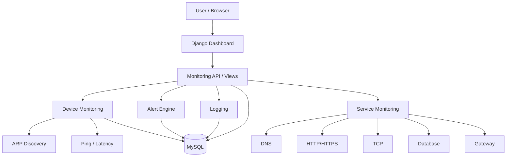
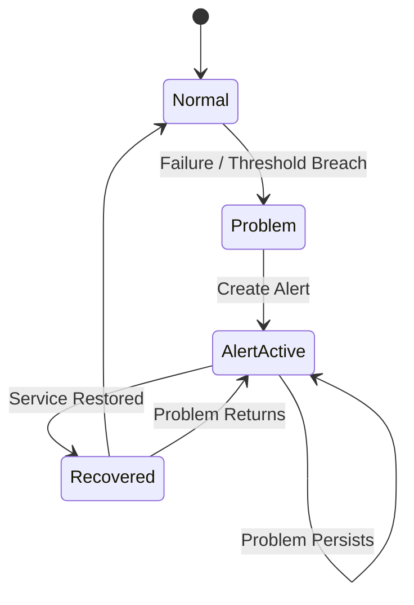

# 🌐 Network Monitoring System

<p align="center">
  
  
</p>

<p align="center">
  <strong>A Django-based platform for monitoring network health, devices, services, performance, and alerts.</strong>
</p>

<p align="center">
  <a href="#-features">Features</a> •
  <a href="#-architecture">Architecture</a> •
  <a href="#-installation">Installation</a> •
  <a href="#-technology-stack">Tech Stack</a>
</p>

---

## 📌 Overview

**Network Monitoring System** is a web-based monitoring platform built with **Django**. It provides a centralized view of network health, connected devices, service availability, performance metrics, logs, and alerts.

The monitoring workflow is:

```text
Discover → Monitor → Measure → Analyze → Alert → Recover
```

The project was developed as a Computer Engineering project combining **networking, backend development, databases, monitoring, and web technologies**.

---

## ✨ Features

### 🔎 Network Discovery
<p align="center">
  
</p>
- LAN device discovery using ARP scanning
- IP and MAC address detection
- New-device detection and database synchronization
- First-seen and last-seen tracking

### 💻 Device Monitoring
- Online/offline status
- IP, MAC, name, and device type
- Latest ping and latency
- Packet-loss statistics
- Last-seen information

<p align="center">
  
</p>

### 🌐 Connectivity & Service Monitoring
The system evaluates network health at multiple layers instead of relying on a single ping:

| Check | Purpose |
|---|---|
| Gateway | Local network reachability |
| Internet | External connectivity |
| DNS | Hostname resolution |
| HTTP/HTTPS | Web availability |
| TCP | Host/port reachability |
| Database | Application database connectivity |

Each check can be classified using both **availability** and **latency**.

### 📊 Performance Monitoring
- Ping latency measurement
- Packet-loss calculation
- Response-time tracking
- Latency trend visualization
- Availability monitoring
- Degraded-service detection based on thresholds

### ❤️ Network Health Score
A normalized **0–100 health score** summarizes the current network condition using indicators such as:

- Availability
- Packet loss
- Latency
- Service status

Example latency interpretation:

| Latency | Status |
|---:|---|
| `≤ 50 ms` | Excellent |
| `≤ 100 ms` | Good |
| `≤ 200 ms` | Moderate |
| `≤ 500 ms` | Poor |
| `> 500 ms` | Critical |

### 🚨 State-Aware Alerting
Alerts are managed as **persistent events with state**, rather than creating a new alert for every monitoring cycle.

Supported severities:

```text
INFO → WARNING → CRITICAL
```

The alert engine supports:
- Failure detection
- Severity classification
- Active alert tracking
- Repeated-event suppression
- Recovery detection
- Recovery logging

This prevents alert spam when the same problem continues across multiple checks.

<p align="center">
  
</p>

### 📝 Logging
Important monitoring events are recorded, including:

```text
INFO     Ping successful
WARNING  High latency detected
CRITICAL Connectivity lost
INFO     Connectivity restored
```

### 📈 Dashboard
The dashboard brings the main monitoring information together:

- Network health score
- Connectivity status
- Service status
- Device table
- Active/recent alerts
- Live logs
- Latency trend
- Bandwidth trend
- Monitoring metrics

Selected dashboard components can be refreshed asynchronously using JavaScript/AJAX without a full page reload.

---

## 🏗 Architecture

### High-Level Flow



### Monitoring Pipeline

```text
Network Discovery
       ↓
Device State
       ↓
Connectivity Checks
       ↓
Performance Metrics
       ↓
Health Score
       ↓
Alert Evaluation
       ↓
Dashboard / Logs
       ↓
Recovery
```

### Alert Lifecycle



---

## 🧰 Technology Stack

| Layer | Technology |
|---|---|
| Backend | **Python + Django** |
| ORM | **Django ORM** |
| Network Discovery | **Scapy / ARP** |
| Connectivity | **ICMP / TCP / DNS / HTTP(S)** |
| Ping | **ping3** |
| Frontend | **HTML5 / CSS3 / JavaScript** |
| Templates | **Django Templates** |
| Database | **MySQL** |
| Containerization | **Docker / Docker Compose** |
| Version Control | **Git / GitHub** |

---

## 📁 Project Structure

```text
Network_Monitoring/
├── manage.py
├── requirements.txt
├── Dockerfile
├── docker-compose.yml
├── README.md
│
├── project/
│   ├── settings.py
│   ├── urls.py
│   ├── asgi.py
│   └── wsgi.py
│
├── monitor/
│   ├── models.py
│   ├── views.py
│   ├── forms.py
│   ├── services.py
│   ├── alerts.py
│   ├── monitoring.py
│   ├── scanner.py
│   └── ...
│
├── templates/
├── static/
└── media/
```

---

## 📦 Installation

### 1. Clone the repository

```bash
git clone <repository-url>
cd Network_Monitoring
```

### 2. Create and activate a virtual environment

**Windows**

```bash
python -m venv venv
venv\Scripts\activate
```

**Linux / macOS**

```bash
python3 -m venv venv
source venv/bin/activate
```

### 3. Install dependencies

```bash
pip install -r requirements.txt
```

### 4. Configure environment variables

Create a `.env` file and set the required Django and database settings.

Example:

```env
DJANGO_SECRET_KEY=change-me
DJANGO_DEBUG=False

DB_NAME=network_monitor
DB_USER=network_user
DB_PASSWORD=change-me
DB_HOST=localhost
DB_PORT=3306

DNS_HOSTNAME=google.com
WEB_URL=https://www.google.com
TCP_HOST=www.google.com
TCP_PORT=443
```

> Never commit real passwords, secret keys, or other credentials to GitHub.

### 5. Initialize the database

```bash
python manage.py makemigrations
python manage.py migrate
python manage.py createsuperuser
```

### 6. Run the application

```bash
python manage.py runserver
```

Open:

```text
http://127.0.0.1:8000/
```

---

## 🎓 Project Scope

This project combines concepts from:

**Network Monitoring · ARP · ICMP · TCP/IP · DNS · HTTP/HTTPS · Fault Detection · Performance Monitoring · Alert Management · Django · Database Design · Docker**

It demonstrates how network measurements can be collected, stored, processed, and presented through a web application.

---

## 🤝 Contributing

Contributions and improvements are welcome.

```bash
git checkout -b feature/my-feature
git add .
git commit -m "Add my feature"
git push origin feature/my-feature
```

Then open a Pull Request on GitHub.

---

## 📄 License

This project is currently developed for **educational and academic purposes**.

---

## 👨‍💻 Author

**Network Monitoring System**

```text
Network Monitoring
        +
Network Reliability
        +
Django Web Development
        +
Infrastructure Health
        +
Alert Management
```

---

> **A web-based network monitoring platform for discovering, monitoring, analyzing, and managing network health.**
